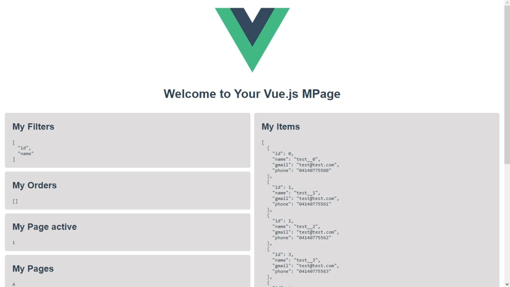
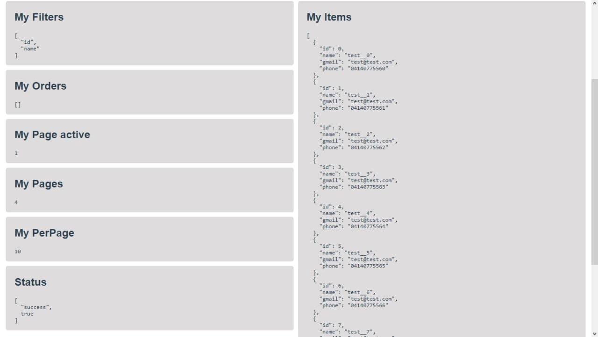

  
  

# Page management "MPage" for VUE

## Introduction

The following library is created to facilitate the data sample that we obtain from any api that we create.

What we are trying to achieve with this template is that the use of vue is much easier than it already is normally that by just matching a variable to an array of objects, these objects are saved in the VUE state and that you can automatically access these data very easily and quickly...
