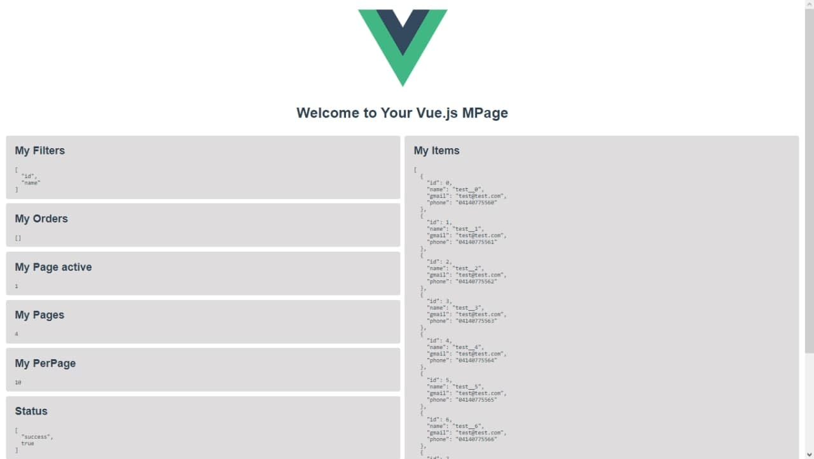

<p align="center">
  
</p>

# Page management "MPage" for VUE

## Introduction

The following library is created to facilitate the data sample that we obtain from any api that we create.

What we are trying to achieve with this template is that the use of vue is much easier than it already is normally that by just matching a variable to an array of objects, these objects are saved in the VUE state and that you can automatically access these data very easily and quickly...


## Install

NPM:
```bash
npm install --save @darens/mpage
```

## How to use

First of all we must import the MPage classes in our component as follows:

```js
import { MPage } from '@darens/mpage';
```

Once the class is imported we proceed to create some things necessary for its use

### Mutation "mp_save_store"

It will be vitally important to create a mutation in the store that we are going to use with the name of 'mp_save_store' so that our class can update our store for us.

It is structured in the following way:

```js
mutations: {
  mp_save_store (state, params) {
    // Params
    const key = params.key;
    const data = params.data;
    const comparison_key = params.comparison_key;
    // Push items
    data.map((itemToSave) => {
      if(comparison_key){
        // put data
        var index_item = false;
        state[key].map((itemOfState, index) => {
          if(itemToSave[comparison_key] == itemOfState[comparison_key]){
            index_item = index;
          }
        });

        if(index_item != false){
          state[key][index_item] = itemToSave;
        }else{
          state[key].push(itemToSave);
        }

      }else{
        // post data
        state[key].push(itemToSave);
      }
    });
  }
}
```

In this way our class will be able to use it to update and save data in the desired store.

### State "Data to use"

Of course we will need to create a data in our state of the same store that will be in charge of storing all our data in this case we will use the data called 'users'.

```js
var test = [];

for (var i = 0; i < 40; i++) {
  test.push({
    id: i,
    name: 'test__'+i,
    gmail: 'test@test.com',
    phone: '0414077556'+i,
  });
}

state: {
  users: [
    ...test
  ]
},
```

Now we can start using our class that we import later in our component.

The first thing we will need to do is create our 'data' 3 variables which will be:

### page
Here we will store the current page and at the time of changing this variable all our data will change depending on the page we want to access.

### filter
This will be our search value that will serve to filter our data depending on the value that this variable takes.

### mp_main
This is where we will instantiate the MPage class imported from our library to be used later to paginate, filter and update our data.


```js
data(){
  return{
    mp_main: new MPage(this.$store, null, 10, ['id', 'name']),
    page: 1,
    filter: null
  }
},
```

## Parameters of class 'MPage'

| Params       | Type    | Required | Default     | Description |
| ---          | ---     | ---      | ---         | ---         |
| Store        | Object  | True     | this.$store | Object of 'VUE' necessary for the operation of the class, since with this you will be able to access the store. |
| Name Store   | String  | False    | null        | If in your project you are working with multiple stores you will need to specify the name to which you are going to access. |
| PerPage      | Number  | False    | 10          | This number symbolizes the amount of elements that will be displayed per page. |
| Filters      | Array   | False    | []          | Filters to be used for specified searches. |
<!-- | Orders       | Array   | False    | []          | Types of possible orders. | -->


## Computed

Finally we will only need to create our computed data which will be in charge of paging, filtering and updating our data.

```js
computed:{
  users:{
    get(){ return this.mp_main.getItems('users', this.page, this.filter); },
    set(value){
      this.mp_main.save(value, 'users');
      return this.mp_main.getItems('users', this.page, this.filter);
    }
  }
},
```

Here we find two functions, one that is responsible for paging and filtering our data, which is 'getItems', just like we have the one that is responsible for updating our store 'save'.

## getItems

| Params       | Type     | Required | Default     | Description |
| ---          | ---      | ---      | ---         | ---         |
| Key Store    | String   | True     | ---         | Here the store key will be sent, which in this case would be 'users' as we defined previously in the store status. |
| Page Active  | Number   | True     | 1           | This is where we will make use of the data variable that we created previously called 'page', so that when it changes its value automatically our 'get' method is executed and changes the page. |
| Filter       | Any      | False    | null        | This is where we will make use of the data variable that we created previously called 'filter', so that when it changes its value automatically our 'get' method is executed and makes a specific search of our data. |


## save

| Params       | Type     | Required | Default     | Description |
| ---          | ---      | ---      | ---         | ---         |
| Value        | Any      | True     | ---         | This is where our object will go or our arrangement of objects that will be stored in our state. |
| Key Store    | String   | True     | ---         | Here the store key will be sent, which in this case would be 'users' as we defined previously in the store status. |


Once all this is done we can make use of our computed variable called 'users' we can show it in our html:

```html
<template>
   <div>
     {{users}}
   </div>
</template>
```

As well as matching an object or an array of objects so that our set method is executed and our data is updated.


```js
sendInfo(){
  this.users = {id: 1, name: 'Edit to one', gmail: 'edit@gmail.com', phone: '041475656'};
}
```

Final and complete example of our component:

```html
<template>
  <div class="mp-main">
    <div class="mp-introduction">
      
      <h1>Welcome to Your Vue.js MPage</h1>
    </div>

    <div>
      <a @click="sendInfo" href="#">Edit object</a>
    </div>

    <pre>{{users}}</pre>
  </div>
</template>

<script>
import { MPage } from '@darens/mpage';

export default {
  name: 'App',
  data(){
    return{
      mp_main: new MPage(this.$store, null, 10, ['id', 'name']),
      page: 1,
      filter: null
    }
  },
  computed:{
    users:{
      get(){ return this.mp_main.getItems('users', this.page, this.filter); },
      set(value){
        this.mp_main.save(value, 'users');
        return this.mp_main.getItems('users', this.page, this.filter);
      }
    }
  },
  methods:{
    sendInfo(){
      this.users = {id: 1, name: 'Edit to one', gmail: 'edit@gmail.com', phone: '041475656'};
    }
  }
}
</script>

<style lang="scss">
.mp-main {
  font-family: sans-serif;
  -webkit-font-smoothing: antialiased;
  -moz-osx-font-smoothing: grayscale;
  color: #2c3e50;
}
.mp-introduction{
  text-align: center;
}
</style>
```

## Creator

 - Created by Andres Rodrigues (@darens), 29/12/2020.
